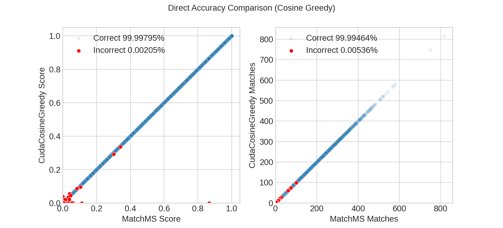

# CudaMS
<table>
<tr>
  <td>
    <a href="https://huggingface.co/spaces/TornikeO/cudams" rel="nofollow"></a>
  </td>
  <td>
    <a target="_blank" href="https://colab.research.google.com/drive/15RpnFVeiJmpR7i3VGF8qtBpA_Fsdb2EQ?usp=sharing">
      
    </a>
  </td>
  <td>
    <a target="_blank" href="https://colab.research.google.com/github/PangeAI/cudams/blob/main/notebooks/samples/upload_your_own_mgf.ipynb">
      
    </a>
  </td>
  <td>
    <a target="_blank" href="https://colab.research.google.com/github/PangeAI/cudams/blob/main/notebooks/accuracy/accuracy_vs_match_limit.ipynb">
      
    </a>
  </td>
</tr>
</table>

Calculate similarity between large number of mass spectra using a GPU. CudaMS aims to provide very fast replacements for commonly used similarity functions in [matchms](https://github.com/matchms/matchms/).

<div style='text-align:center'>
  
  
  
</div>



Note: CudaCosineGreedy uses fp32 format, wherease MatchMS uses fp64, and this difference causes most of the occasional errors.

# Quickstart

## Install
```bash
pip install git+https://github.com/PangeAI/cudams
```

Use with MatchMS:

```py
from matchms import calculate_scores
from matchms.importing import load_from_mgf
from cudams.utils import download
from cudams.similarity import CudaCosineGreedy, \
                              CudaModifiedCosine, \
                              CudaFingerprintSimilarity

sample_file = download('pesticides.mgf')
references = list(load_from_mgf(sample_file))
queries = list(load_from_mgf(sample_file))

similarity_function = CudaCosineGreedy()

scores = calculate_scores( 
  references=references,
  queries=queries,
  similarity_function=similarity_function, 
)

scores.scores_by_query(queries[42], 'CudaCosineGreedy_score', sort=True)
```

# Supported similarity functions

- `CudaModifiedCosine`, equivalent to [ModifiedCosine](https://matchms.readthedocs.io/en/latest/api/matchms.similarity.ModifiedCosine.html)
- `CudaCosineGreedy`, equivalent to [CosineGreedy](https://matchms.readthedocs.io/en/latest/_modules/matchms/similarity/CosineGreedy.html)
- `CudaFingerprintSimilarity`, equivalent to [FingerprintSimilarity](https://matchms.readthedocs.io/en/latest/_modules/matchms/similarity/FingerprintSimilarity.html) (`jaccard`, `cosine`, `dice`)

- More coming soon - requests are welcome!


# Installation
The **easiest way** to get started is to visit our [huggingface space](https://huggingface.co/spaces/TornikeO/cudams), which offers a simple UI, where you can upload a pair of MGF files and run similarity calculations there (we also offer some control over parameters). 

Alternatively, you can use the <a target="_blank" href="https://colab.research.google.com/github/PangeAI/cudams/blob/main/notebooks/samples/colab_tutorial_pesticide.ipynb">colab notebook
</a>  that has everything ready for you.

For local installations, we recommend using [`micromamba`](https://mamba.readthedocs.io/en/latest/installation/micromamba-installation.html), it is much faster. 

Total size of install in a fresh conda environment will be around 7-8GB (heaviest packages are `pytorch`, and `cudatoolkit`).

```bash
# Install cudatoolkit
conda install nvidia::cuda-toolkit -y

# Install torch (follow the official guide https://pytorch.org/get-started/locally/#start-locally)
conda install pytorch -c pytorch -c nvidia -y

# Install numba (follow the offical guide: https://numba.pydata.org/numba-doc/latest/user/installing.html#installing-using-conda-on-x86-x86-64-power-platforms)
conda install numba -y

# Install this repository
pip install git+https://github.com/PangeAI/cudams
```

## Run in docker

The `pytorch/pytorch:2.2.1-cuda12.1-cudnn8-devel` has nearly everything you need. Once inside, do:

```
pip install git+https://github.com/PangeAI/cudams
```

## Run on vast.ai

Use [this template](https://cloud.vast.ai/?ref_id=51575&template_id=f45f6048db515291bda978a34e908d09) as a starting point, once inside, simply do:

```
pip install git+https://github.com/PangeAI/cudams
```
# Frequently asked questions

### I want to get `referenece_id`, `query_id` and `score` as 1D arrays, separately. How do I do this?

Use the `"sparse"` mode. It directly gives you the columns. You can set `sparse_threshold` to `0`, at which point you will get *all* the scores.

```py
from cudams.similarity import CudaCosineGreedy

scores_cu = CudaCosineGreedy(
    sparse_threshold=0.75, # anything with a lower score gets discarded
).matrix(references, queries, array_type='sparse')

# Unpack sparse results as 1D arrays
ref_id, query_id, scores = scores_cu.data['sparse_score']
ref_id, query_id, matches = scores_cu.data['sparse_matches']
```

