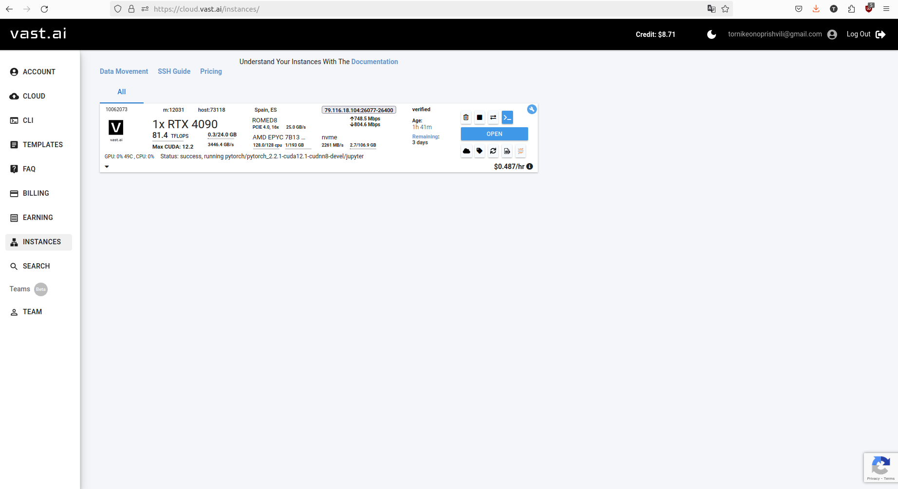
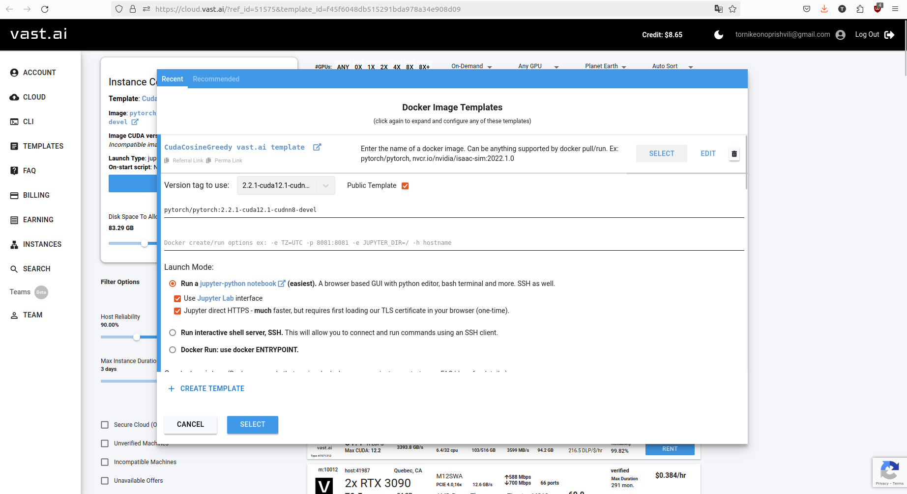

# Notebooks

Every plot and metric in the paper, are kept in this folder. We usually rely on [vast.ai](https://vast.ai/) GPU hardware rental service to perform large-scale performance tests.

# Sample notebooks

These notebooks live under `samples/` directory, and they are meant to be used straight away on Colab, using T4 instance. Read more about these in the README.md.

# Figures

We used vast.ai resources for most of our calculations.

Here's a docker configuration template on vast.ai:
> [Template Link with a referral](https://cloud.vast.ai/?ref_id=51575&creator_id=51575&name=CudaCosineGreedy%20vast.ai%20template); [Template permanent link](https://cloud.vast.ai/?ref_id=51575&template_id=f45f6048db515291bda978a34e908d09). (Referral links might refund some of your compute expenses)

## About performance notebooks

In order to measure performance, we need to use several different machines (GPUs).

For replicating performance notebooks, it is necessary to run each notebook on a specified machine to get accurate estimates (i.e. on colab).

Because of this, in order to **replicate results**, you have to execute each notebook in this on a different machine. (e.g. `performance/default_params_on_colab_t4.ipynb` is to be executed on colab, T4 instance).

Once all notebooks are executed at least once, the `generate_plots.ipynb` reads all notebooks as a raw JSON, then extracts the last cell, which always contains a JSON-ized performance results from the performed run, and plots the results. We report these plots in the paper.

Our recommendation is to use `vast.ai` instances for this.

For example, here's a machine that we used to report the RTX4090 performance:

# Prototyping notebooks

These notebooks are not meant to be used by the end-user but instead they keep most of the scratch-pad work done prior to arriving at the CUDA-based solution. We explored several options to speed up the CosineGreedy before using CUDA (e.g. MP-parallel  c++ implementation of CosineGreedy on xtensor, and thread-parallel cython implementations). The best results by far come from CUDA.
